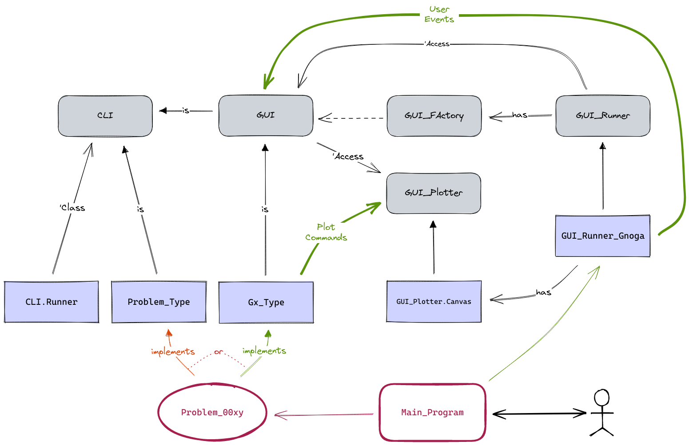

# Project Euler

## Design

There are two main interfaces you can implement to integrate a solution to a
Problem of Project Euler. The most basic one is `CLI`, the Command Line
Interface. Just few obvious functions to give some context and the solution
are required to implement. Once you have a `CLI`solution, then you can
consider to implement `GUI`, the Graphical User Interface, to add awesome
visualizations of the algorithm.

Implementing the `GUI` interface is independent of the final graphical
library or framework. There are few interfaces to abstract it, like a
`Plotter` and some event handlers.

The diagram below shows how users interact with a program that implements
either the `CLI` or the `GUI`. In our case, because only Gnoga + HTML is
currently used and the final graphical library, the `GUI_Runner_Gnoga` (the
software artifact that runs your algorithm) will receive user events, whilst
your implementation will transparently send plot commands to the HTML Canvas.

---
## Example

Let's consider a quite new problem. Number 826: _Birds on a wire_.

_The following problem is taken from Project Euler:_
> ### Birds on a wire
> #### Problem 826
> 
> Consider a wire of length $1$ unit between two posts. Every morning birds
> land on it randomly with every point on the wire equally likely to host a
> bird. The interval from each bird to its closest neighbour is then painted.
>
> Define $F(n)$ to be the expected length of the wire that is painted. You
> are given $F(3) = 0.5$.
>
> Find the average of where ranges through all odd prime less than a million.
> Give your answer rounded to $10$ places after the decimal point.

We show now how to create a solution by implementing the Command Line
Interface:

### Implement the problem

   * Create the specification file
     `project_euler/src/problem/0801-0900/p0826_birds_on_a_wire.ads`:
     * Use the template file `project_euler/src/problem/p0000_template.ads`.
     * Copy the template file to the spec file and edit it.
     * Fill in your data and problem details: use an already created problem
       in case of doubt (e.g. `p0013_large_sum.ads`).
       * All functions, except `Answer` (and possibly `Notes`), can be
         defined there.
   * Create the implementation file
     `project_euler/src/problem/0801-0900/p0826_birds_on_a_wire.ads`:
     * Use the template file `project_euler/src/problem/p0000_template.adb`.
     * Copy the template to the implementation file and edit it.
     * Copy the same header from the specification file.
     * Implement the function `Answer`.
       * Feel free to use your preferred algorithm or library; we suggest you
         to use the [Euler Tools](https://github.com/rocher/euler_tools)
         library.

At this point what you have is an implementation of the Project Euler Command
Line Interface.

### Create the program

The next step consist in creating a program that takes your implementation
and runs it. That is done with the appropriate Runner object. Both software
components, your implementation and the Runners, put together form the
*program*.

   * Create the program file
     `project_euler/src/cli/0801-0900/c0826_birds_on_a_wire.adb`:
     * Use the template file `project_euler/src/cli/c0000_template.adb`.
     * Fill in your data and problem details.

### Compile the program

Now that you have created the program, you need to compile it. Just edit the
file `project_euler.gpr` and add the corresponding line `,"c0826_birds_on_a_wire.adb"`